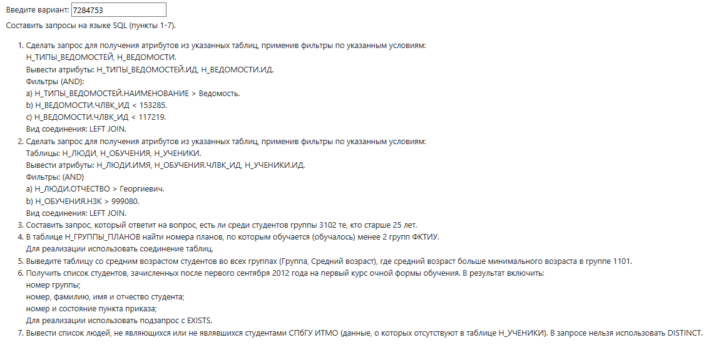

# Лабораторная работа №2

> Вариант: **7284753**

## Задание:

По варианту, выданному преподавателем, составить и выполнить запросы к [базе данных "Учебный процесс"](https://se.ifmo.ru/documents/10180/733702/%D0%91%D0%94+%D0%A3%D1%87%D0%B5%D0%B1%D0%BD%D1%8B%D0%B9+%D0%9F%D1%80%D0%BE%D1%86%D0%B5%D1%81%D1%81.pdf/2eae3fcd-ea34-4496-924b-6ee4e889a9e5).



Команда для подключения к базе данных *ucheb*:

```bash
psql -h pg -d ucheb
```

## Отчёт по работе должен содержать:
1. Текст задания.
2. Реализацию запросов на SQL.
3. Выводы по работе.

## Темы для подготовки к защите лабораторной работы:
1. SQL
2. Соединение таблиц
3. Подзапросы
4. Представления
5. Последовательности